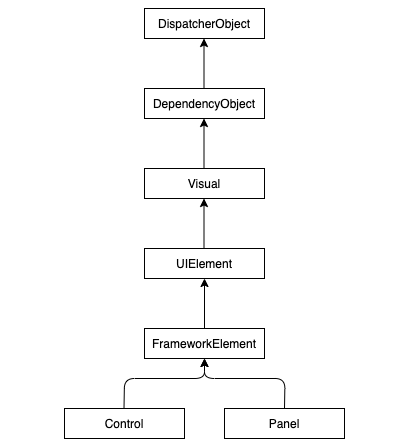

# Windows Presentation Foundation
WPF namespace: `System.Windows`
## Architecture
A WPF applications needs the following libraries:
* PresentationFramework.dll: control elements, styling, text, images, animation, ...
* PresentationCore.dll: visual, drawing, brush; implements a visual tree
* WindowsBase.dll: DispatcherObject, DependencyObject (for dependency properties, e. g. to implement MVVM)

## XAML
Declarative Programming: User Interfaces can be written in XAML (eXtensible Application Markup Language)
```xaml
<Window x:Class="XamlExperiments.SimpleDialog"
  xmlns="http://schemas.microsoft.com/winfx/2006/xaml/presentation"
  xmlns:x="http://.../xaml"
  Title="XamlExperiments"
  Height="107"
  Width="200"
>
  <Grid>
    <Label
      Height="25"
      HorizontalAlignment="Left"
      Margin="20,15,0,0"
      Name="label"
      VerticalAlignment="Top"
      Width="60"
    >
      Name:
    </Label>
    <TextBox
      Height="25"
      Margin="80,15,10,0"
      Name="textBox"
      VerticalAlignment="Top"
      Padding="5,5,5,5"
    >
      Hello
    </TextBox>
    <Button
      Margin="0,0,0,10"
      Name="button"
      Height="23"
      VerticalAlignment="Bottom"
      HorizontalAlignment="Center"
      Width="80"
    >
      Ok
    </Button>
  </Grid>
</Window>
```

### Property Elements
Property elements can hold complex children types:
```xaml
<Button>
  <Button.Content>
    <Image Source="smiley.jpg" Height="50" Width="80"/>
  </Button.Content>
</Button>
```

## Structure of WPF Applications
### Hello World
```csharp
public class HelloWindow : Window {
  private Button btn;
  
  public HelloWindow() {
    btn = new Button() { Content = "Quit" };
    btn.Click += new RoutedEventHandler(OnClick);
    this.AddChild(btn);
    this.Title = "WPF Hello App";
    this.Width = 120;
    this.Height = 80;
  }
  
  void OnClick(object sender, RoutedEventArgs e) => this.Close();
  
  [STAThread]
  static void Main(string[] args) {
    Application app = new Application();
    app.Run(new HelloWindow());
  }
}
```

### `Application`and `Window` Classes
* class `Application`: manages the windows and the main loop of the application (`Application app = new Application();`)
* method `Run`: starts the main loop
* method `ShutDown`: ends the main loop
* property `MainWindow`: sets the main window of the application
* property `ShutdownMode`: `OnLastWindowClose`, `OnMainWindowClose` or `OnExplicitShutdown`
* event `Startup`: main loop has been started
* event `SessionEnding`: user logs out of window

### Hello World in XAML
Resource definitions for the global application:
```xaml
<Application
  xmlns=" http://schemas.microsoft.com/winfx/2006/xaml/presentation"
  StartupUri="HelloWindow.xaml"
/>
```

Window description:
```xaml
<Window
  xmlns="http://schemas.microsoft.com/winfx/2006/xaml/presentation"
  xmlns:x="http://schemas.microsoft.com/winfx/2006/xaml"
  x:Class="HelloWindow"
  Title="WPF Hello App"
  Width="120"
  Height="80"
>
  <Button Click="OnClick">Quit</Button>
</Window>
```

```csharp
public partial class HelloWorld : Window {
  private void OnClick(object sender, RoutedEventArgs e) {
    this.Close();
  }
}
```

## WPF Base Classes


### DispatcherObject
* all WPF classes are not thread safe
* the dispatcher which is associated with the `DispatcherObject` puts every method call into an event queue, which will be processed by the UI thread

### DependencyObject
* enables dependency properties
* dependency properties have additional characteristics: default value, inheritance in control element tree, event firing when value changes
* dependency properties are used for styling, databinding and animation

## WPF Controls
### `Button`
```xaml
<Button
  x:Name="submitButton"
  Grid.Column="1"
  Grid.Row="3"
  Grid.ColumnSpan="2"
  Margin="10"
  Click="submitButton_Click"
>
  Click Me
</Button>
```

### `CheckBox`

### `ComboBox`
* displays a dropdown list
```xaml
<ComboBox>
  <ComboBoxItem>ComboBox Item #1</ComboBoxItem>
  <ComboBoxItem IsSelected="True">ComboBox Item #2</ComboBoxItem>
  <ComboBoxItem>ComboBox Item #3</ComboBoxItem>
</ComboBox>
```

### `Image`
* display an image

### `TextBlock`
* renders simple text (strings only)
* often used as a label
```xaml
<TextBlock
  Grid.Column="1"
  Grid.Row="1"
  FontSize="36"
  Grid.ColumnSpan="3"
  Margin="0,0,0,20"
>
  Hello World
</TextBlock>
```

### `TextBox`
* lets the user input text
```xaml
<TextBox
  AcceptsReturn="True"
  TextWrapping="Wrap"
  SpellCheck.IsEnabled="True"
  Language="en-US"
  SelectionChanged="TextBox_SelectionChanged"
/>
```
```csharp
private void TextBox_SelectionChanged(object sender, RoutedEventArgs e)
{
  ...
}
```

## WPF Panels
### `DockPanel`
* docks child controls to the top, bottom, left or right

### `Grid`

### `StackPanel`
* stacks up child controls next to each other without wrapping into the next line

### `UniformGrid`
* like the `Grid` but all rows and columns have the same size

### `WrapPanel`
* child control next to each other until there is no more space
