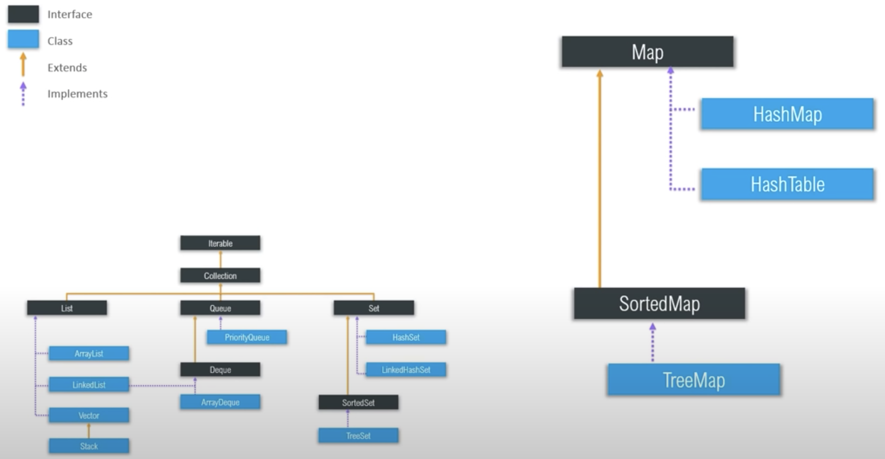

# Java Collection Framework



## Methods of the Collection Interface

- add()
- addAll()
- clear()
- contains()
- containsAll()
- equals()
- hashCode(): returns the hash code value
- isEmpty()
- iterator()
- parallelStream(): returns a parallel stream
- remove()
- removeAll()
- removeIf()
- retainAll(): retains only the elements that are contained in the specified collection
- size()
- spliterator(): creates a Spliterator
- stream(): returns a sequential stream
- toArray()

## ArrayList
Elements can be added and removed dynamically.

```java
import java.util.ArrayList;
// ...
ArrayList box = new ArrayList();
Horse fury = new Horse("Fury", 1955);
box.add(fury));
```

## LinkedList
A sequence of links which contains items.

```java
import java.util.List;
import java.util.LinkedList;
import java.util.ListIterator;
import java.util.Iterator;

LinkedList<Element> list = new LinkedList<>();
Iterator<Element> iterator = list.iterator();
while (iterator.hasNext()) {
  Element element = iterator.next();
  // modify the element
}
```

## Vector
Like ArrayList, but synchronized (thread safe).


## Stack

Last in, first out.

## PriorityQueue

It sorts the data for us.

## ArrayDeque

Data can be inserted at the front and at the back. Can also behave like a queue or a stack.

## HashSet

Contains only unique elements and uses the hashing mechanism to store the elements. The order is unpredictable.

## LinkedHashSet

Contains only unique elements and uses a hash table and a doubly-linked list to store the elements. The order is predictable.

## TreeSet

Contains only unique elements and sorts them in ascending order.

## HashMap

Not synchronized (better for non-threaded applications). One null key and any number of null values allowed.

## LinkedHashMap

Like HashMap, but the order is predictable.

## HashTable

Synchronized. No null keys or values allowed.

## TreeMap

Sorts the map according to the natural ordering of its keys.
